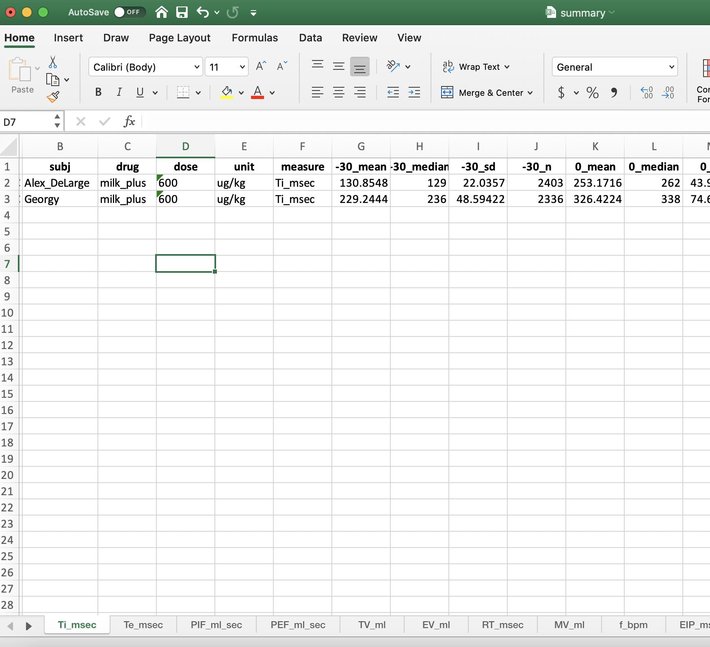

<!-- README.md is generated from README.Rmd. Please edit that file -->

```{r, include = FALSE}
knitr::opts_chunk$set(
  collapse = TRUE,
  comment = "#>",
  fig.path = "man/figures/README-",
  out.width = "100%"
)
```

# rvent

<!-- badges: start -->
[](https://github.com/https://github.com/c1au6i0/rvent)
[](https://github.com/c1au6i0/rvent/commits/master)
<!-- badges: end -->


The goal of rvent is to summarize, analyze and plot experimental data recorded with the [SCIREQ pletysmograph](https://www.scireq.com/).

The package is meant to be used by users with limited knowledge of *R* and, eventually, to be the foundation for an interactive shiny app.

## Installation

``` r
# install.packages("devtools")
devtools::install_github("c1au6i0/rvent")
```
## Example

This is a basic example of  how to use the  package:

```{r example, eval=FALSE}
library(rvent)

# open dialog to select the directory with iox files to import
# import them and make them tidy
sess1 <- import_session() 

# open a series of interactive windows to select bin and baseline duration,
# missing info regarding drug treatments and summarizes the data
# in an excel file
summarize_vent(sess1)

# for each subject creates a plot with 20 facets corresponding to the 20 recorded
# variables
session_plots(sess1, svDialogs::dlg_dir()$dir)
```

## Summary Excel file

This is how  a summary excel file looks.  Bin is 30 minute, subjects are Alex_DeLarge and Georgie and the drug administered is milk_plus.



## Plot

This is the plot for the subject Alex_DeLarge that received milk-plus.

```{r plot, fig.width=12, fig.height=12, echo=FALSE, message=FALSE}
library(rvent)
library(tidyverse)

load("R/sysdata.rda")

class(dat_vent) <- "data.frame"

x <- dat_vent %>% 
  filter(subj == "rat1") %>% 
  mutate(drug = "milk-plus", subj = "Alex_DeLarge") 

class(x) <- c("vent", "data.frame")

autoplot(x, fsave = FALSE)
```

